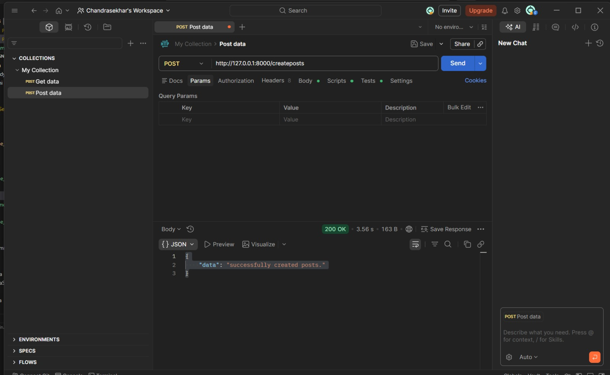
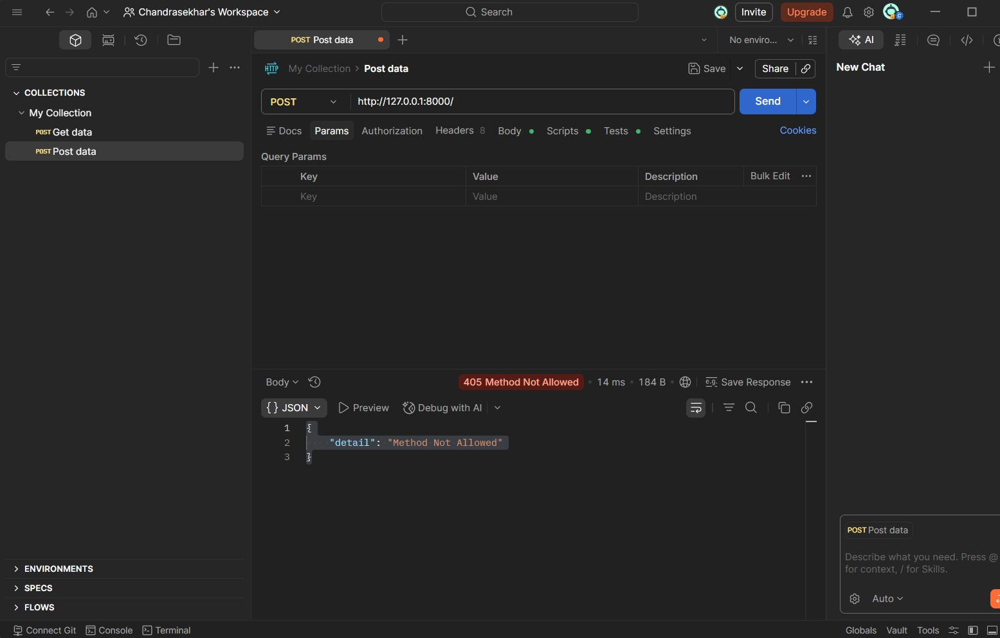
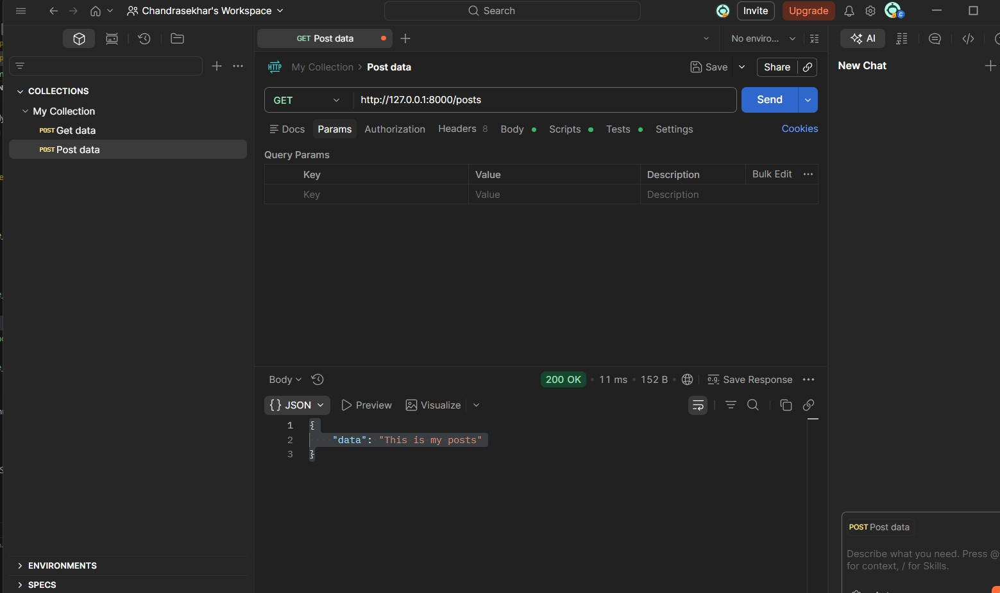

# Day 4: Postman Testing - FastAPI

## Objective
Test all FastAPI endpoints using Postman and capture screenshots of responses.

---

## Tools Used
- FastAPI
- Postman
- Python
- VS Code

---

## Base URL
http://127.0.0.1:8000

---

## 1️⃣ GET Request - Fetch Posts

**Endpoint:**  
GET /posts  

**URL:**  
http://127.0.0.1:8000/posts  

**Description:**  
This endpoint retrieves all posts from the API.

**Screenshot:**  

---

## 2️⃣ POST Request - Create Post

**Endpoint:**  
POST /createposts  

**URL:**  
http://127.0.0.1:8000/createposts  

**Description:**  
This endpoint creates a new post successfully.

**Screenshot:**  

---

## 3️⃣ Error Handling - Method Not Allowed

**Endpoint:**  
POST /  

**URL:**  
http://127.0.0.1:8000/  

**Description:**  
This request demonstrates API error handling when an incorrect HTTP method is used.

**Screenshot:**  

---

## Learning Outcomes
- Learned how to test APIs using Postman
- Understood GET and POST methods
- Verified API responses
- Practiced error handling
- Documented API testing using screenshots